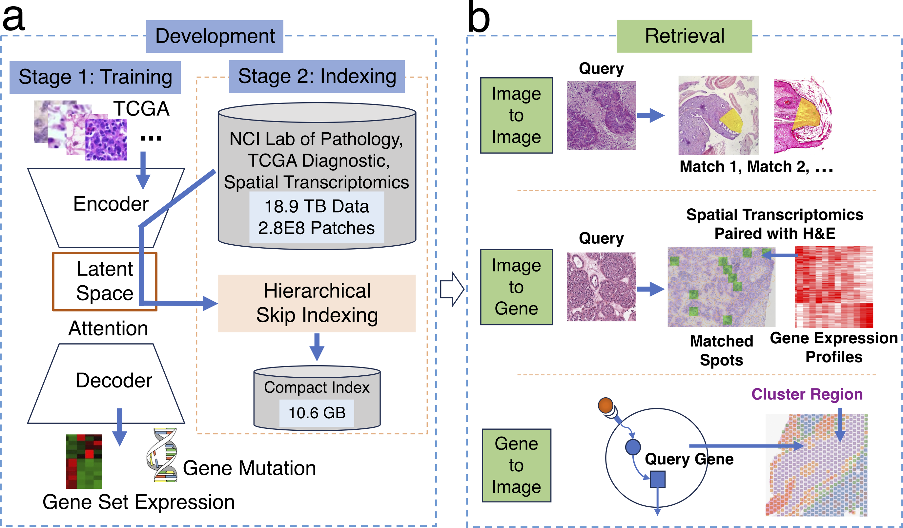
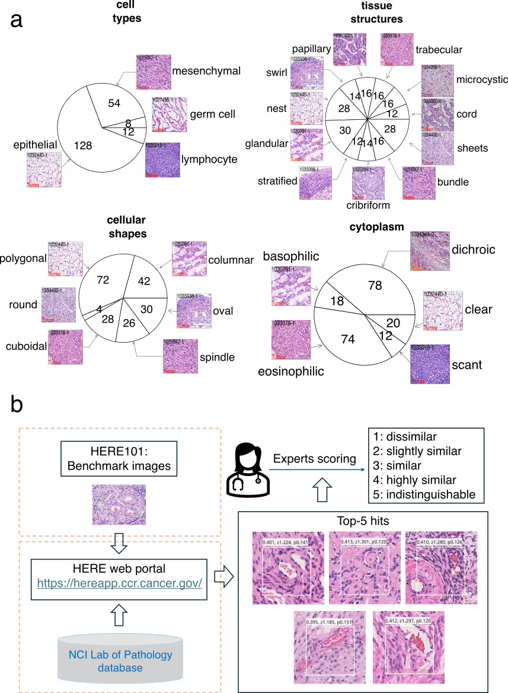

# Google-like web engine for tumor pathology image retrievals on massive scales

**HERE training code: https://github.com/data2intelligence/HERE_training**

**HERE web deployment code: https://github.com/data2intelligence/HERE_website**

**HERE web app: https://hereapp.ccr.cancer.gov**

**HERE101 dataset: https://github.com/data2intelligence/HERE101**

**[Jiang Lab, CDSL, CCR, NCI, NIH](https://ccr.cancer.gov/staff-directory/peng-jiang)**

[Zisha Zhong](https://scholar.google.com/citations?user=FYvMdNcAAAAJ), [Jinlin Huang], [Lanqi Gong], [Beibei Ru](https://scholar.google.com/citations?user=QB7Aj4YAAAAJ&hl=en), [Rohit Paul], [Jason Levine], [Kenneth Aldape](https://ccr.cancer.gov/staff-directory/kenneth-aldape), [Peng Jiang](https://ccr.cancer.gov/staff-directory/peng-jiang)

[[`Paper`](https://ccr.cancer.gov/staff-directory/peng-jiang)] [[`Project`](https://ccr.cancer.gov/staff-directory/peng-jiang)] [[`HERE App`](https://hereapp.ccr.cancer.gov/)] [[`HERE101 Dataset`](https://github.com/data2intelligence/HERE101)] [[`BibTeX`](#citing-here-paper)]

Hematoxylin and Eosin staining (H&E) is widely used in clinical practice, but efficient and versatile Google-like retrieval tools are lacking. We developed the **H&E Retrieval Engine (HERE, https://hereapp.ccr.cancer.gov)** to assist clinicians in analyzing patient cases based on image similarities to database records. Using H&E image regions as input, HERE searches 18.9 terabytes of whole-slide images from the National Cancer Institute and The Cancer Genome Atlas and returns top images containing regions similar to the query. HERE scans high-resolution images in the database using accurate artificial intelligence encoding and ultra-efficient hierarchical skip indexing. HERE demonstrated performance superior to current image retrieval tools based on pathologist scoring of images returned using benchmark queries that represent key image features in human tumors. By pairing spatial transcriptomics with H&E images, HERE further enables retrievals from images to gene expression data and genes to image features.



To evaluate the accuracy of the HERE web portal, we performed an evaluation with a human pathologist. First, the pathologist designed a benchmark called **“HERE101”** that consists of 101 diagnostic H&E images from different human tumors and organs (Fig. 3a). The benchmark covers four image characteristics key to describing tumor histology: 1, cell types; 2, tissue structures; 3, cellular shapes; and 4, cytoplasmic features. Cell types (aspect 1) include epithelial cells, lymphocytes, mesenchymal cells (e.g., smooth muscle cells, adipose cells, Schwann cells, endothelial cells, etc.), and germ cells. Tissue structures (aspect 2) include cord, nest, cribriform, sheet, microcystic, swirl, glandular, trabecular, bundle, stratified, and papillary. Cell shapes (aspect 3) include polygonal, columnar, cuboidal, spindle, round, and oval. Cytoplasmic features (aspect 4) include dichroic, basophilic, eosinophilic, clear, and scant.



## License

The models are licensed under the [Apache 2.0 license](./LICENSE). Please refer to our research paper for more details on the models.

## Citing HERE

If you use HERE or HERE101 dataset in your research, please use the following BibTeX entry.

```bibtex
@article{jiang2024ncihereapp,
  title={Google-like web engine for tumor pathology image retrievals on massive scales},
  author={Zhong, Zisha and Huang, Jinlin and Gong, Lanqi and Ru, Beibei and Paul, Rohit and Levine, Jason and Aldape, Kenneth and Jiang Peng},
  journal={Submitted},
  url={Submitted},
  year={2024}
}
```


